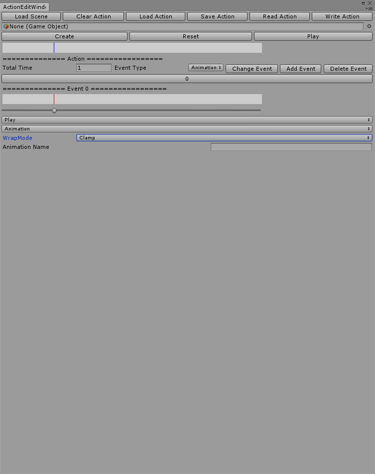

# Unity3D Character Skill Editor

Unity3D 技能编辑器

目的：

		数据与逻辑分离

		编辑器编辑后的数据存储在文件中，保证只要数据就能得到相同的效果

技能编辑器功能：

		1，时间轴为标准

		2，事件为单位，可以有多个事件组成整个技能

		3，每个事件有自己的触发点位，在时间轴上显示

		4，事件功能包括

			动画播放，循环

			特效实例化，偏移，父节点绑定

			受击盒，大小，偏移量

			消息命令，人物移动，等其他扩展变化

		5，以制定的时间为结束点

